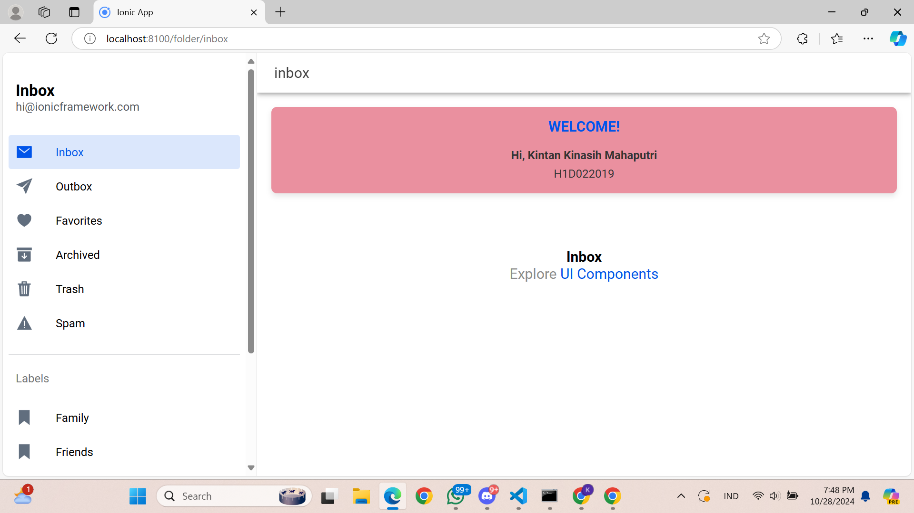

# LabMobile6_Kintan Kinasih Mahaputri_ShiftA
 Nama: Kintan Kinasih Mahaputri
 NIM : H1D022019
 Shift: A

 

Penjelasan: 
Langkah - Langkah menambahkan komponen pada halaman Ionic, pertama-tama Anda dapat membuat halaman baru atau menggunakan halaman yang sudah ada. Halaman baru dapat dibuat menggunakan perintah `ionic generate page namaHalaman`, yang secara otomatis membuat file HTML, CSS, dan TypeScript khusus untuk halaman tersebut. Setelah halaman siap, buka file HTML halaman (misalnya `nama-halaman.page.html`) untuk mulai menambahkan komponen. Misalnya, untuk menambahkan komponen `ion-card`, Anda bisa langsung menuliskannya dalam format HTML, seperti `<ion-card><ion-card-header><ion-card-title>Selamat Datang di Ionic</ion-card-title></ion-card-header></ion-card-content>`. Komponen ini kemudian akan muncul sebagai kartu di halaman aplikasi. 

Jika ingin menyesuaikan tampilan komponen, Anda bisa mengedit file CSS halaman (misalnya, `nama-halaman.page.scss`) dengan menambahkan gaya tambahan seperti warna atau ukuran. Untuk membuat komponen lebih dinamis, gunakan file TypeScript halaman (`nama-halaman.page.ts`) untuk mendeklarasikan variabel yang dapat ditampilkan pada komponen. Setelah semua perubahan selesai, jalankan aplikasi dengan perintah `ionic serve` untuk melihat hasilnya di browser. Dengan cara ini, komponen seperti `ion-button`, `ion-input`, `ion-list`, dan lainnya dapat ditambahkan dan dikustomisasi sesuai kebutuhan. Ionic menyediakan dokumentasi lengkap untuk berbagai komponen, membantu pengguna dalam membangun antarmuka yang interaktif dan menarik.
